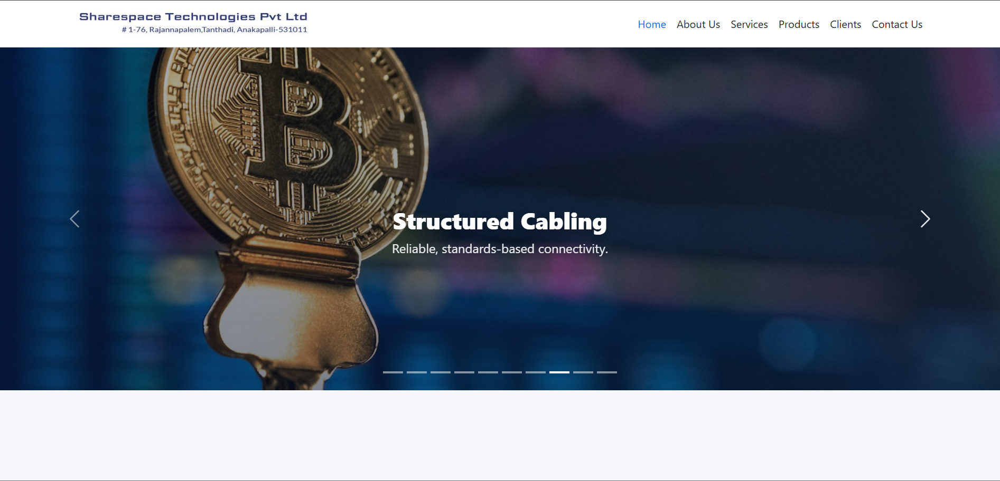

Absolutely! We can make your README more **engaging, interactive, and visually appealing** on GitHub by:

* Adding badges (license, HTML/CSS, Bootstrap version).
* Using collapsible sections for category details.
* Adding screenshots or GIF placeholders for hero, products, services, and clients sections.
* Highlighting commands with color-coded code blocks.
* Using emojis and icons for better readability.

Here’s a **refined, interactive, and visually enhanced version** of your README:

---

# 🚀 Sharespace Technologies Pvt Ltd Website



[](https://developer.mozilla.org/en-US/docs/Web/HTML)
[](https://developer.mozilla.org/en-US/docs/Web/CSS)
[](https://getbootstrap.com/)
[](LICENSE)

---

## 🌐 Overview

This repository contains the source code for the **official website of Sharespace Technologies Pvt Ltd** (formerly NCS Technologies), an integrated IT service management and support company.

The website showcases **products, services, clients, and credentials**, providing a **professional, interactive, and responsive user experience**.

Built using **HTML, CSS, Bootstrap**, and JavaScript, it features:

* Hero banners with **10-image slideshow**
* **Interactive product and service cards** with “View More” expansion
* Responsive **client logo carousel**
* Smooth **animations** and hover effects

---

## ✨ Features

<details>
<summary>1. Home Page 🏠</summary>

* Full-width **hero slideshow** with 10 images and always-visible overlay text.
* **About section** detailing the company’s history, services, and achievements.
* **Company credentials** displayed in styled cards (CIN, MSME, GST, GeM Seller ID).
* **Services preview** with interactive cards.
* **Clients section** displaying logos in a responsive carousel/grid.
* Smooth **scroll animations** and hover effects.


</details>

<details>
<summary>2. Products Section 📦</summary>

* Users select **product categories** from header dropdown; no general Products page.
* **Category-specific pages** feature:

  * Large, responsive product cards
  * Product images, names, short descriptions
  * **“View More”** interaction: clicking reduces image size and shows additional details
* Smooth hover and scroll animations


</details>

<details>
<summary>3. Services Section 🛠️</summary>

* Dropdown categories in header; no general Services page.
* Interactive **service cards** with images/icons, names, short description.
* **“View More”** expands details with smooth animations.
* Styled cards with hover effects and responsive layout


</details>

<details>
<summary>4. Clients Page 🤝</summary>

* Display all client logos in a **carousel or responsive grid**.
* Logos are clickable (optional links).
* Smooth animations for scrolling and hover effects


</details>

<details>
<summary>5. Header Navigation 🌟</summary>

* **Products and Services dropdowns** show only one menu at a time.
* Smooth hover/click transitions for desktop and mobile.
* Fully accessible and responsive design

</details>

---

## 🛠️ Technologies Used

* **HTML5** – Semantic markup and structure
* **CSS3** – Styling, animations, and responsive layout
* **Bootstrap 5** – Grid system, cards, carousels, responsive utilities
* **JavaScript** – “View More” toggle, dropdown control, carousel behavior

---

## 🗂️ Project Structure

```
/root
│
├─ index.html           # Home page
├─ products/            # Product category pages
│    ├─ oem-products.html
│    ├─ security.html
│    └─ network.html
├─ services/            # Service category pages
│    ├─ fms.html
│    ├─ amc.html
│    ├─ rental.html
│    └─ camc.html
├─ clients.html         # Clients page
├─ css/
│    └─ style.css       # Main stylesheet
├─ js/
│    └─ script.js       # JavaScript for interactivity
├─ images/              # All images (hero, products, services, clients)
└─ README.md            # Project documentation
```

---

## 🔑 Key Features & UX Highlights

* **Interactive Cards:** Hover effects, smooth transitions, expandable “View More” sections
* **Hero Banners:** Always-visible overlay text on full-width banners
* **Dropdown Menus:** Only one dropdown visible at a time for better UX
* **Responsive Design:** Desktop, tablet, and mobile-friendly
* **Animations:** Fade-in, slide-up, zoom-in, hover effects

---

## ⚡ How to Run Locally

```bash
# Clone the repository
git clone https://github.com/VenkataManikantaVemulapudi/sharespace-website.git

# Open index.html in browser
```

No backend is required as this is a **static website**.

---

## 🚀 Future Enhancements

* Backend CMS for dynamic products, services, and clients
* Contact form integration (email/database)
* Multi-language support
* SEO and performance optimization

---

## 👨‍💻 Author

* **Name:** Venkata Manikanta Vemulapudi
* **Role:** Frontend Developer
* **Contact:** [venkatamanikantavemulapudi01@gmail.com](mailto:venkatamanikantavemulapudi01@gmail.com)


